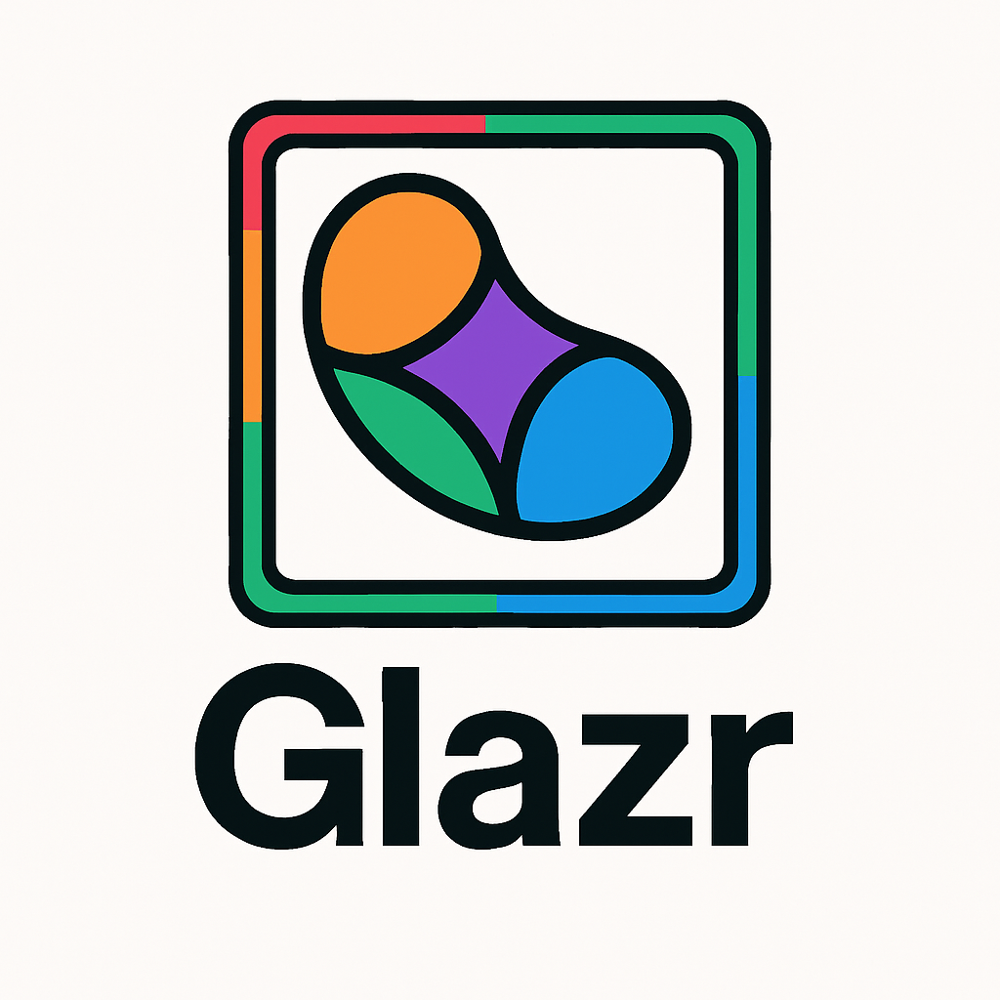

<h1 align="center">Glazr - Crie design modernos </h1>

<p align="center">
  
  <br>
  <em>Glazr é um micro design system projeto para atender sites modernos.
    <br>Usamos apenas Js e bastante CSS.</em>
  <br>
</p>

<hr>

## Exemplos 
Se quiser ver alguns sites construidos com Glazr temos alguns como esses:

-[Oct8][oct8]
-[Portifolio][ports]

## Documentação 
Para iniciar com o Glazr saiba o basico de CSS , se quiser se aprofundar com estilos mais sofisticados recomendamos o uso de Js

 - [Componentes Simples][simples]

 ### Avançados
 - [Estados com JS][estatesJS]


<hr>

## 🧱 Estrutura base de um componente

```html
<div class="jelli-to-white jelli-glow jelli-container-glass jelli-banner jelli-text-appear jelli-border jelli-orange-text">
  Texto aqui
</div>
```

Este elemento:
- Possui **fundo degradê claro** com `jelli-to-white`
- Tem **efeito de vidro e transparência** via `jelli-container-glass`
- Tem **efeito de brilho sutil** via `jelli-glow`
- Aparece com animação suave `jelli-text-appear`
- Usa borda arredondada grande `jelli-border`
- Aplica cor de texto laranja `jelli-orange-text`

---

## 🎨 Cores

### Fundos
- `.jelli-orange-bg` → fundo laranja translúcido
- `.jelli-grape-bg` → degradê uva
- `.jelli-pink-bg` → degradê rosa
- `.jelli-red-bg` → degradê vermelho suave
- `.jelli-lemon-bg` → degradê amarelo-limão
- `.jelli-white-1-bg` → branco translúcido

### Textos
- `.jelli-orange-text` → texto laranja queimado
- `.jelli-grape-text` → texto roxo escuro
- `.jelli-pink-text` → texto rosa profundo
- `.jelli-red-text` → texto vermelho escuro
- `.jelli-lemon-text` → texto amarelo-escuro

---

## 💎 Containers

### `.jelli-container`
Container base com fundo translúcido em degradê branco e leve blur.

### `.jelli-container-glass`
Container com **efeito de vidro real**, ideal para botões, cards ou caixas leves.
Inclui:
- Borda translúcida
- Blur
- Padding e fonte configurados

### `.jelli-banner`
Usado para criar um banner vertical: `width: 100%`, `height: 70vh`

---

## 🖋 Borda e brilho

### `.jelli-border`
Arredondamento grande estilo jelly (border-radius: 5vh)

### `.jelli-border-ilum`
Borda com **efeito de luz interna**, ideal para destacar seções.

### `.jelli-destak`
Borda branca com sombra interna + externa para destaque elegante.

### `.jelli-glow`
Borda com **brilho de vidro translúcido**, que aumenta no hover.

---

## ✨ Efeitos de luz e profundidade

- `.jelli-light-soft` → luz branca suave nas bordas laterais e inferior
- `.jelli-light-medium` → luz cinza média
- `.jelli-light-strong` → sombra preta difusa, cria profundidade

---

## 🎛 Botões e Inputs

### `.jelli-button` ou `.jelli-button-bg`
Botão com efeito glass, bordas translúcidas, blur e sombra suave. Ao hover: leve zoom.

### `.jelli-input`
Input com visual jelly:
- Fundo translúcido
- Borda com blur
- Placeholder suave
- Destaque ao foco

---

## 🧪 Animações e Interação

### `.jelli-text-appear`
Texto surge de baixo com leve tremor (animado via keyframes)

### `.jelli-hover-movey`
Move suavemente o elemento para cima ao passar o mouse

### `.jelli-text-gradient-animate`
Texto com degradê animado (efeito arco colorido sobre as letras)

### `.jelli-border-gradient-animate`
Borda animada em degradê colorido que gira em loop

---

## 📚 Layouts e Listas

### `.jelli-list`
Transforma uma `<ul>` em lista horizontal com espaçamento. Botões internos ganham sublinhado no hover.

--- 

## 📌 Exemplos rápidos

```html
<button class="jelli-button jelli-orange-text jelli-hover-movey">
  Botão Jelly
</button>

<div class="jelli-container jelli-lemon-bg jelli-border-glow-loop">
  Componente com fundo lemon e borda animada
</div>
```

---

**Gostou do Glazr coloque uma estrela! :star: :arrow_up:.**
